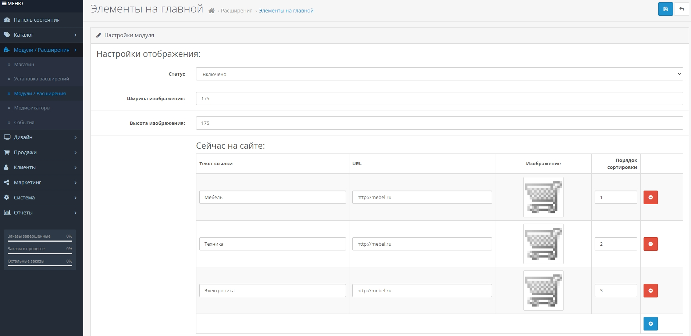

# customelements
Модуль для OpenCart CMS, который позволяет сформировать блок контента с дочерними элементами в виде ссылок. 
Модуль создавался для конкретной задачи, но т.к. бесплатных модулей с похожим функционалом не нашел, выкладываю свою разработку.  

# Установка модулей из панели управления Opencart
Скачайте файл модуля (customelements.ocmod.zip)  
Сделайте полный бэкап сайта. 
Зайдите в панель управления сайтом. 
Перейдите в меню «Дополнения», далее «Установка дополнений». 
Нажмите на значок «Загрузить». 
Выберите файл модуля. 
Произойдет установка модуля. 
Модуль успешно установлен.  
Структура файлов предельно понятна. 
Шаблон вывода элементов на фронтенде имеет следующий вид: 

  &lt;div class="customelements-block"&gt; 
    &lt;a href="URL"&gt; 
      &lt;div class="__element"&gt; 
        &lt;img alt="NAME" src="IMGURL"&gt; 
        &lt;span&gt;NAME&lt;/span&gt; 
      &lt;/div&gt; 
    &lt;/a&gt; 
    ...
  &lt;/div&gt; 

Стили прописывать в своих файлах стилей для классов из шаблона. 
#TODO 
#реализовать перевод некоторых переменных, заменить статичный текст на фронте этими переменными. 
#сделать возможность формирования ссылок, открывающихся в новом окне. 
#шаблон не ок, надо поменять
